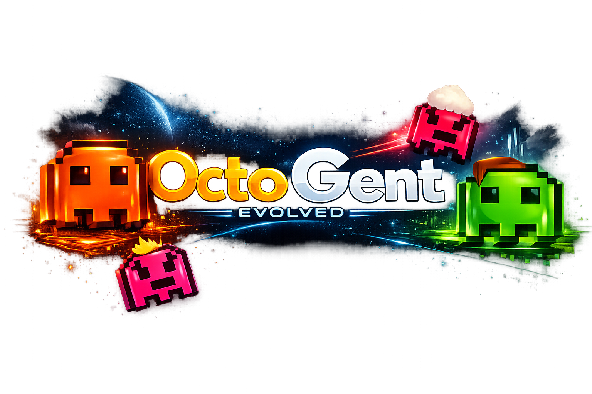

<div align="center">



<strong>too many terminals, not enough tentacles</strong>
<br />
<br />

[](https://www.typescriptlang.org/)
[](https://nodejs.org/)
[](https://github.com/hesamsheikh/octogent)

</div>

# Octogent-Evolved

> **Fork of [hesamsheikh/octogent](https://github.com/hesamsheikh/octogent)** by **Hesam Sheikh** — original design, canvas UI, tentacle/worktree model, and channel-messaging primitive. This fork makes the swarm flow work reliably under real load and adds canvas task visibility, security hardening, and coordinator self-cleanup. See [`NOTICE.md`](./NOTICE.md) for full attribution.

It's really not fun to have **ten Claude Code sessions open at once**, constantly switching between them and trying to remember what each one was supposed to do. *Things get blurry fast* when one agent is doing documentation, another is touching the database, another is changing the API, and another is somewhere in the frontend. **Octogent** gives each job its own <u>scoped context, notes, and task list</u>, while also making it possible for Claude Code to **spawn other Claude Code agents**, assign them work, and communicate with them.

## The Vision

Treat terminal coding agents as parts of a bigger orchestration layer — not the final interface by themselves. The point is not to hide **Claude Code** behind abstractions; the point is to make *multi-agent work less chaotic for the developer* on a real codebase.

---

## Features

### Tentacles — scoped context for every job

A **tentacle** is a folder under `.octogent/tentacles/<id>/` holding `CONTEXT.md`, `todo.md`, and any supporting notes. Each agent works inside its own tentacle scope instead of a broad, messy chat context. Tasks stay visible, trackable, and ready for delegation.

### Swarm orchestration

Spawn 1–9 worker agents from a single button click. Each worker gets its own git worktree and works on an unclaimed `- [ ]` item from `todo.md`. A coordinator agent supervises the workers, merges their branches, ticks off completed tasks, and cleans up — all without operator involvement.

**How it works:**

1. **Planner** (`tentacle-planner`) proposes a tentacle layout and writes `CONTEXT.md` + `todo.md`. Offers a 10-option startup menu: Full run, Propose only, Fill gaps, Re-enrich, Add todos, Prune todos, Status report, Spawn all, Single tentacle, Remap.
2. **Workers** pick unclaimed tasks, implement them in isolated worktrees, and commit with a structured `DONE:` or `BLOCKED:` marker.
3. **Coordinator** polls branches every 30–60 seconds, merges on evidence (commits, not channel messages), ticks `todo.md` checkboxes on `main`, and runs post-merge verification.
4. **Auto-cleanup** — coordinator deletes all worker terminals then itself when all merges land. The canvas clears automatically.

### Reliable prompt delivery

Worker terminals receive their initial prompts via a signal-gated state machine rather than a fixed timer. The bootstrap waits for `user-prompt-submit` hook callbacks before advancing, retrying with a bare `\r` if Enter gets eaten. Fixes the 5+ concurrent worker case where prompts would stage but never submit.

Channel messages to workers also use bracketed-paste + deliberate `\r`, matching the same idiom. Hook URLs are re-installed on server restart so workers never fire curl at a dead port.

### Accurate agent state badges

The IDLE/PROCESSING badge reflects what the agent is actually doing:

- Any PTY output → `processing` immediately (no regex matching required)
- `Stop` hook → back to `idle` (fires exactly once per turn)
- Badge no longer flips to IDLE mid-turn from stray `notification.idle_prompt` signals

### Canvas task visibility

Each octopus node on the canvas shows live todo progress:

- **White fraction** (`0/3`) — tasks assigned, none started
- **Orange fraction** (`1/3`, `2/3`) — some tasks complete
- **Green checkmark** — all tasks done

The deck view polls every 10 seconds so counts stay fresh.

### Coordinator nudge

If a worker branch shows `ahead=0` and its runtime state has been `idle` for more than one poll cycle, the coordinator sends a channel nudge prompting the worker to resume — instead of silently waiting.

### Identity & portability

Every spawned terminal inherits identity env vars (`OCTOGENT_TERMINAL_ID`, `OCTOGENT_TENTACLE_ID`, `OCTOGENT_ROLE`, `OCTOGENT_API_BASE`). The CLI resolves the correct API base by walking up from `cwd`, so `octogent channel send` works correctly from inside git worktrees.

### Security hardening

- **Path traversal** — `path.normalize()` + prefix check on static file serving; `isSafeTentaclePath()` blocks `..`, `:`, and backslashes in tentacle file reads
- **XSS** — markdown sanitizer blocks dangerous tags (`iframe`, `object`, `embed`, `form`, `input`), catches unquoted event handlers (`onerror=alert(1)`), and blocks `data:text/html` URLs
- **Error safety** — `.catch()` on all fire-and-forget async paths; JSON body parse errors return 400 instead of crashing; WebSocket error messages sanitized before forwarding

---

## How the swarm flow works

```
Planner → writes CONTEXT.md + todo.md
         ↓
Spawn Swarm (1–9 workers)
         ↓
Workers (parallel, isolated worktrees)
  pick unclaimed task → implement → commit DONE:/BLOCKED:
         ↓
Coordinator (poll loop, 30s cadence)
  ahead>0 + clean? → merge to integration branch
  all merged? → merge to main, tick todo.md, push
  worker idle too long? → send nudge
  all done? → delete workers → delete self
         ↓
Canvas shows checkmarks ✓
```

---

## Install

This fork is **not published to npm**. Install from the repo directly.

### Option A — git clone + `npm link` (recommended for dev)

```bash
git clone https://github.com/special-place-administrator/Octogent-Evolved.git
cd Octogent-Evolved
pnpm install
pnpm build
npm link
```

After `npm link`, the global `octogent` command points at this checkout. Edit sources, re-run `pnpm build`, restart the server — changes are live. **Do not run `npm i -g octogent`** — that pulls the upstream registry version and silently overwrites the symlink.

### Option B — install from tarball

On the machine that has the repo built:

```bash
cd Octogent-Evolved
npm pack
# produces octogent-evolved-0.2.0.tgz
```

On the target machine:

```bash
npm install -g ./octogent-evolved-0.2.0.tgz
```

### Option C — install directly from GitHub

```bash
npm install -g git+https://github.com/special-place-administrator/Octogent-Evolved.git
```

---

## Quick start

```bash
cd <your-project>
octogent
```

On first run, Octogent creates the local `.octogent/` scaffold, assigns a stable project ID, picks an available local API port starting at `8787`, and opens the UI unless `OCTOGENT_NO_OPEN=1` is set.

## Requirements

- Node.js `22+`
- `claude` — the Claude Code CLI (the supported agent)
- `git` — for worktree terminals
- `gh` — for GitHub pull-request features
- `curl` — for the Claude hook callback flow
- `pnpm@11+` — for dev builds

## What persists

- `.octogent/` — project-local scaffold and worktrees
- `~/.octogent/projects/<project-id>/state/` — runtime state, transcripts, monitor cache, metadata
- `.octogent/tentacles/<tentacle-id>/` — context files and todos that agents read

PTY sessions survive browser reloads during the idle grace period. They do **not** survive an API restart. A restart deletes in-flight channel queues.

## Docs (upstream)

Mental model and conceptual docs are inherited from upstream and remain accurate:

- [Tentacles](docs/concepts/tentacles.md)
- [Working With Todos](docs/guides/working-with-todos.md)
- [Orchestrating Child Agents](docs/guides/orchestrating-child-agents.md)
- [Inter-Agent Messaging](docs/guides/inter-agent-messaging.md)
- [CLI Reference](docs/reference/cli.md)
- [Filesystem Layout](docs/reference/filesystem-layout.md)
- [API Reference](docs/reference/api.md)
- [Experimental Features](docs/reference/experimental-features.md)
- [Troubleshooting](docs/reference/troubleshooting.md)

## License

MIT, inherited from upstream. See [`LICENSE`](./LICENSE) and [`NOTICE.md`](./NOTICE.md).

## Credit

Original Octogent by [Hesam Sheikh](https://github.com/hesamsheikh). All the design work that makes this thing worth forking belongs to that project.
